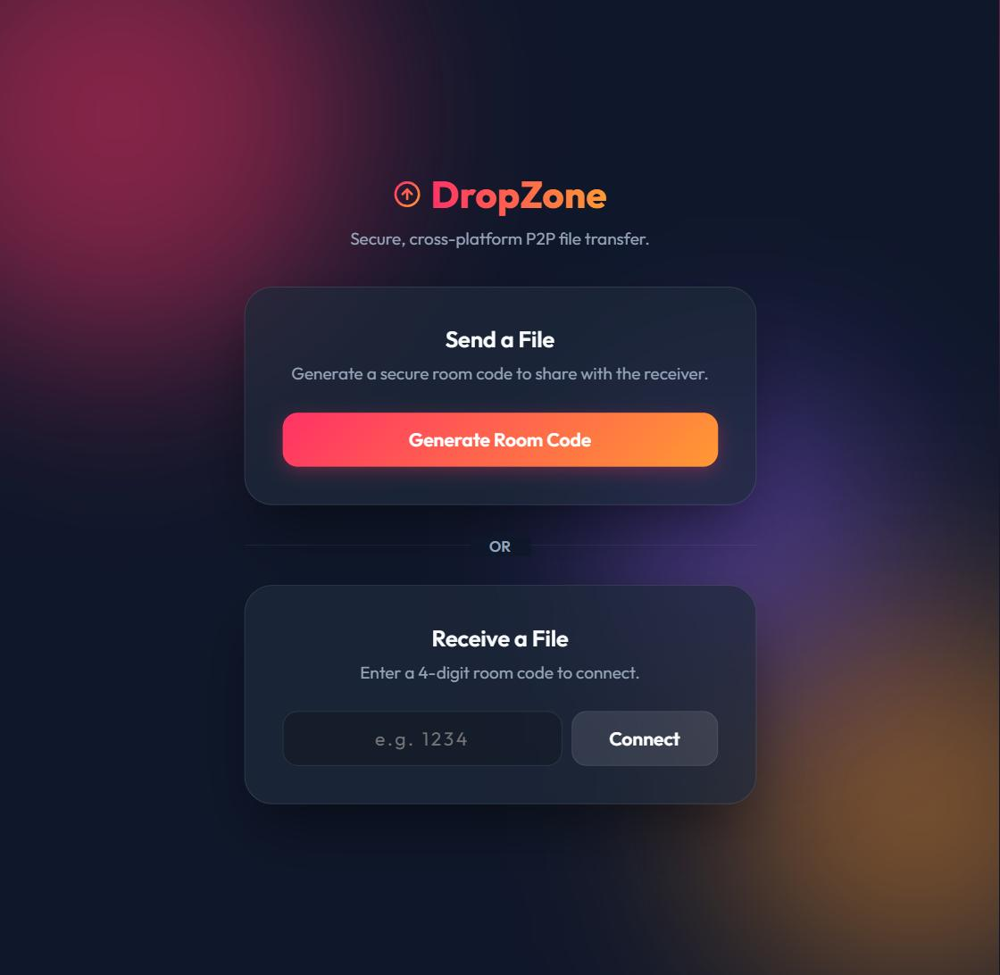
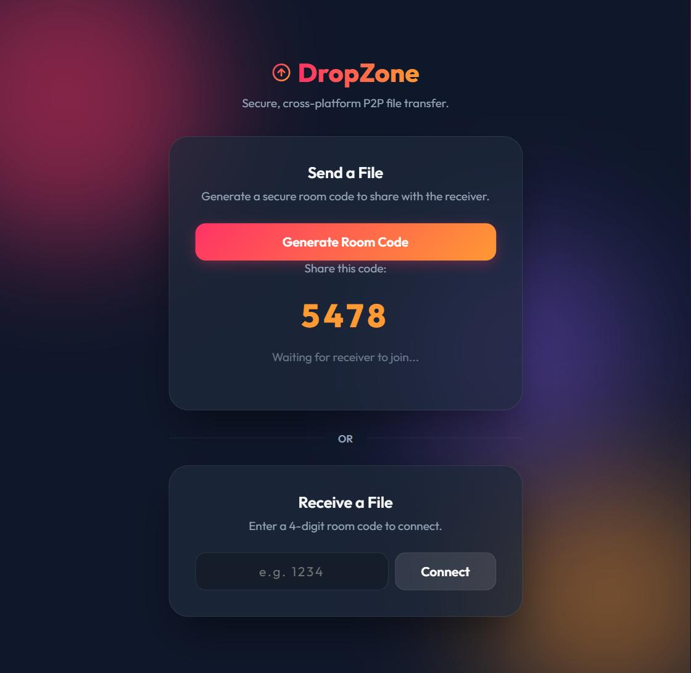
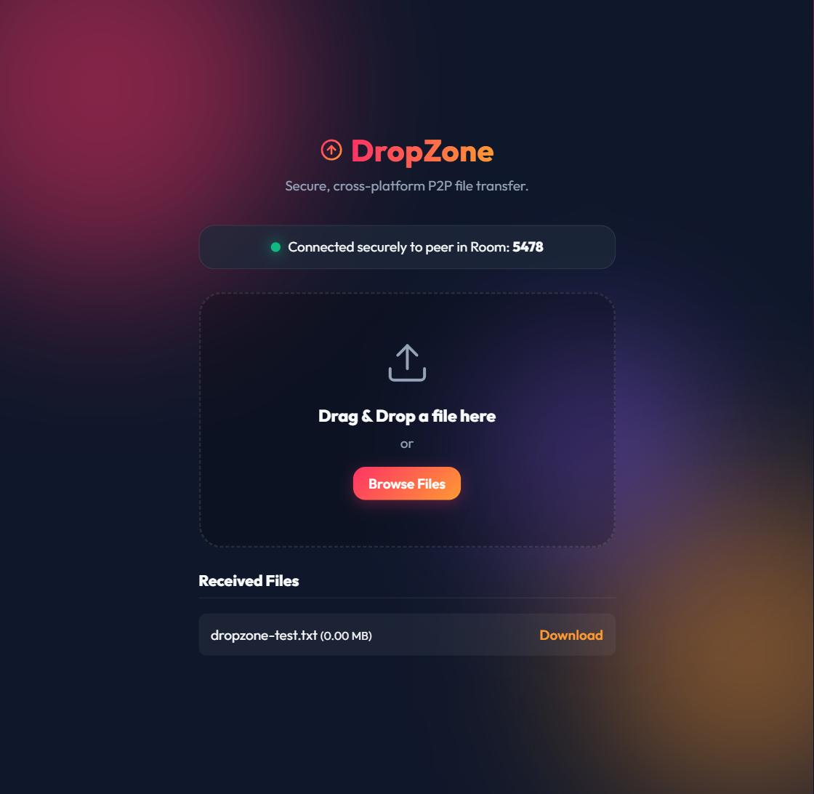

# DropZone



DropZone is a lightweight, cross-platform web application that allows two devices to securely and quickly exchange files directly through their web browsers. 

It leverages **WebRTC** for peer-to-peer (P2P) file transfer, meaning files are sent directly between devices and are never uploaded to or stored on a server.

## Features
- **True Peer-to-Peer:** Files travel directly from sender to receiver.
- **Cross-Platform Compatibility:** Works on any device with a modern web browser (iOS, Android, Windows, macOS, Linux).
- **Secure & Private:** End-to-end encryption via WebRTC.
- **No File Size Limits:** Transfer files of any size without server restrictions.
- **Multiple Files Queueing:** Drag and drop multiple files to send them sequentially.
- **Sleek UI:** Features a beautiful dark-mode interface with a circular progress indicator.

## Screenshots

### Generating a Room Code


### Transferring Files


## How it Works
1. **Device 1 (Sender)** opens the app and clicks **"Generate Room Code"**.
2. **Device 2 (Receiver)** opens the app, enters the 4-digit code, and connects.
3. The server negotiates the WebRTC connection using Socket.io and then steps out of the way.
4. The sender drops files into the dropzone, and they stream directly to the receiver.

## Running Locally

### Prerequisites
- Node.js installed

### Setup
1. Clone the repository.
2. Install dependencies:
   ```bash
   npm install
   ```
3. Start the server:
   ```bash
   node server.js
   ```
4. Open `http://localhost:3000` in your browser.

## Built With
- HTML / CSS / Vanilla JS (Frontend)
- Node.js / Express (Backend)
- Socket.io (Signaling)
- WebRTC (P2P Transfer)
